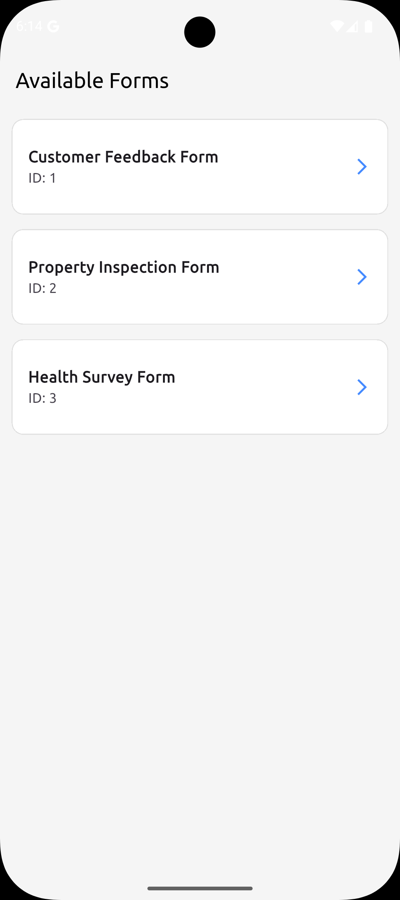
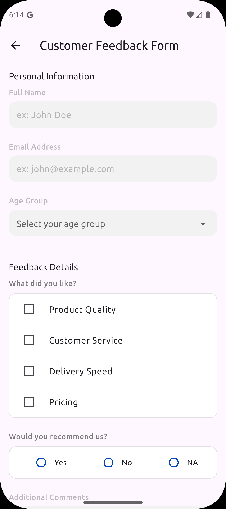
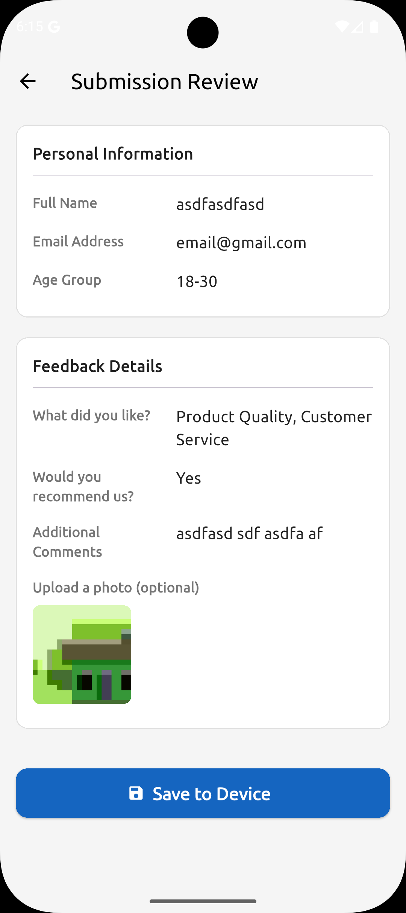
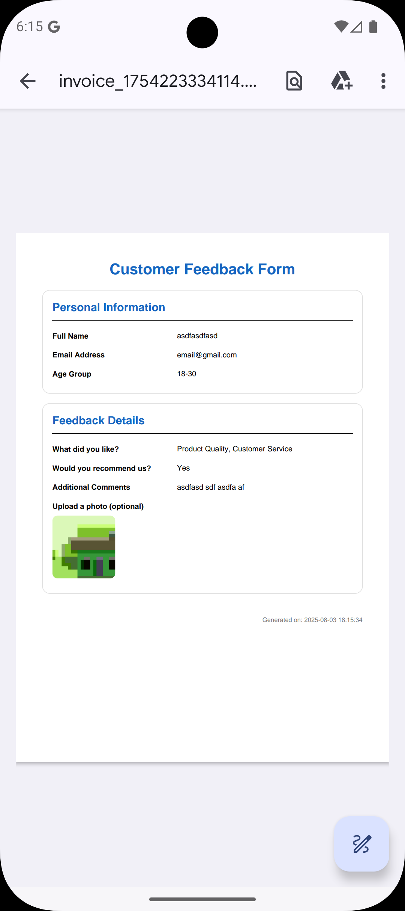

# Dynamic Form App

**Repository:** [https://github.com/masud51435/dynamic-form-app](https://github.com/masud51435/dynamic-form-app)


A Flutter application that dynamically builds forms from JSON data, allowing users to fill them out and generate a PDF invoice.

## Table of Contents

* [Features](#features)
* [Screenshots](#screenshots)
* [Getting Started](#getting-started)
* [Dependencies](#dependencies)
* [Project Structure](#project-structure)
* [Contributing](#contributing)
* [License](#license)

## Features

*   **Dynamic Form Generation:** Forms are built on the fly from JSON files, making it easy to add or modify forms without changing the application's code.
*   **Multiple Field Types:** Supports a variety of form fields, including:
    *   Text fields
    *   Dropdown lists
    *   Checkbox lists
    *   Yes/No radio buttons
    *   Image pickers
*   **Form Validation:** Ensures that all required fields are filled out correctly before submission.
*   **PDF Invoice Generation:** Generates a PDF invoice of the submitted form data.
*   **File Saving:** Saves the generated PDF to the device's storage.

## Screenshots

| Form List | Form View | Submission View | Invoice |
| :---: | :---: | :---: | :---: |
|  |  |  |  |

## Getting Started

To get started with this project, you'll need to have the Flutter SDK installed. You can find instructions on how to do that [here](https://flutter.dev/docs/get-started/install).

Once you have Flutter installed, you can clone this repository and run the following command to install the dependencies:

```bash
flutter pub get
```

After the dependencies are installed, you can run the app on a connected device or emulator using the following command:

```bash
flutter run
```

## Dependencies

This project uses the following dependencies:

*   **`get`:** A state management library for Flutter.
*   **`image_picker`:** A plugin for selecting images from the device's gallery or camera.
*   **`path_provider`:** A plugin for finding commonly used locations on the filesystem.
*   **`permission_handler`:** A plugin for requesting and checking permissions.
*   **`google_fonts`:** A package for using Google Fonts in your app.
*   **`pdf`:** A library for creating PDF documents.
*   **`printing`:** A plugin for printing PDF documents.
*   **`open_file`:** A plugin for opening files on the device.

## Project Structure

The project is structured as follows:

```
lib/
├── core/
│   ├── constants/
│   │   └── app_colors.dart
│   └── utils/
│       ├── form_data_helper.dart
│       └── invoice_generator.dart
├── data/
│   └── models/
│       ├── field_model.dart
│       ├── field_properties_model.dart
│       ├── form_model.dart
│       └── section_model.dart
├── presentation/
│   ├── common/
│   │   ├── app_dropdown_button.dart
│   │   ├── app_text_field.dart
│   │   └── image_picker_widget.dart
│   ├── modules/
│   │   ├── form/
│   │   │   ├── bindings/
│   │   │   │   └── form_bindings.dart
│   │   │   ├── controller/
│   │   │   │   └── form_controller.dart
│   │   │   └── views/
│   │   │       ├── form_page.dart
│   │   │       └── widgets/
│   │   │           └── field_widget_factory.dart
│   │   ├── form_lists/
│   │   │   ├── bindings/
│   │   │   │   └── form_list_bindings.dart
│   │   │   ├── controller/
│   │   │   │   └── form_list_controller.dart
│   │   │   └── views/
│   │   │       └── form_list_page.dart
│   │   └── submisson/
│   │       ├── bindings/
│   │       │   └── submisson_bindings.dart
│   │       ├── controller/
│   │       │   └── submisson_controller.dart
│   │       └── views/
│   │           └── submisson_page.dart
│   └── routes/
│       ├── app_pages.dart
│       └── app_routes.dart
└── main.dart
```

## Contributing

Contributions are welcome! If you have any suggestions, bug reports, or feature requests, please open an issue or submit a pull request.

## License

This project is licensed under the MIT License. See the [LICENSE](LICENSE) file for details.
